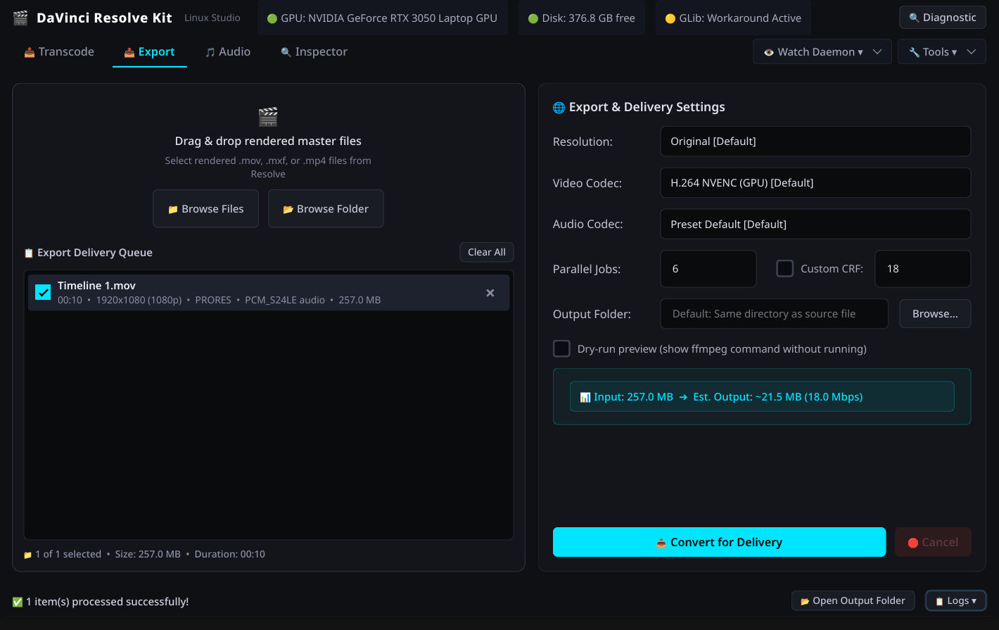

# DaVinci Resolve Kit

A Linux toolkit for DaVinci Resolve: GUI, transcoding, export presets, media inspection, diagnostics, font fixes, backups, and watch-folder automation.

DaVinci Resolve Free on Linux cannot import the most common phone/camera formats directly: H.264/H.265 video and AAC audio. This project wraps the working Linux workflow in a desktop GUI and companion CLI tools.

## Features

- **GUI** for common Resolve Linux workflows
- **Import transcoding** to DNxHR `.mov` or AV1 `.mkv`
- **Audio conversion** to WAV, FLAC, ALAC, or MP3
- **Delivery exports** to H.264, H.265, AV1, WebM, ProRes, and archive formats
- **GPU-accelerated encoding** with NVENC (NVIDIA), AMF (AMD), QSV (Intel), and VAAPI (AMD/Intel) when available
- **Media compatibility inspection** powered by `ffprobe`
- **Watch folder** automation for automatic transcodes
- **Resolve launch fix** for library mismatches, Wayland/X11 quirks, and GPU offload on hybrid laptops
- **Font path fix** for Fusion/Text tools
- **Backup/restore** for Resolve settings, LUTs, scripts, macros, and fonts
- **System diagnostics** with severity-classified checks for GPU, OpenCL, codecs, library mismatches, disk space, and toolkit status

## Screenshots

<!-- Uncomment after adding screenshots to assets/screenshots/ -->
<!--  -->
<!--  -->
<!--  -->

Screenshots coming soon.

## Requirements

Required:

- Linux
- DaVinci Resolve installed at `/opt/resolve`
- `bash`
- `ffmpeg` and `ffprobe`
- `python3`
- `PyQt6` or `PySide6` for the GUI

Optional:

- `parallel` for parallel processing
- `inotify-tools` / `inotifywait` for watch folders
- GPU users: working driver and OpenCL runtime (`opencl-nvidia` on Arch, `rocm-opencl` for AMD, `intel-compute-runtime` for Intel)
- `clinfo` for OpenCL diagnostics

Example packages:

```bash
# Arch / EndeavourOS
sudo pacman -S ffmpeg python python-pyqt6 parallel inotify-tools clinfo

# Debian / Ubuntu
sudo apt install ffmpeg python3 python3-pyqt6 parallel inotify-tools clinfo

# Fedora
sudo dnf install ffmpeg python3 python3-qt6 parallel inotify-tools clinfo
```

## Install

### One-line installer

```bash
curl -fsSL https://raw.githubusercontent.com/DarshanS26/davinci-kit/main/bootstrap.sh | bash
```

This clones the repo, symlinks all tools to `~/.local/bin`, and installs a desktop entry.

### Manual git install

```bash
git clone https://github.com/DarshanS26/davinci-kit.git
cd davinci-kit
./install.sh
```

Make sure `~/.local/bin` is on your `PATH`:

```bash
echo $PATH | grep -q "$HOME/.local/bin" || echo 'Add ~/.local/bin to PATH'
```

### Arch / EndeavourOS (AUR)

```bash
yay -S resolve-kit
```

### Update

```bash
davinci-kit-update
```

### Uninstall

```bash
./install.sh --remove
```

## Quick Start

Launch the GUI from your applications menu (look for **DaVinci Resolve Kit**) or run:

```bash
davinci-kit
```

The GUI has four tabs:

1. **Transcode** — Drop your camera/phone footage, pick a codec (AV1 or DNxHR) and quality, click Start. The output is ready to import into Resolve.

2. **Export** — Drop your Resolve render, pick a delivery format, click Convert. The output is a web-ready MP4/WebM/etc.

3. **Audio** — Drop audio files, pick an output format (WAV, FLAC, ALAC, MP3), click Convert.

4. **Inspector** — Drop any media file to see its codec, resolution, streams, and whether Resolve can import it. If not, it tells you exactly what to do.

### Typical workflow

```text
Camera/phone footage
    ↓
Drop into Transcode tab → get Resolve-ready files
    ↓
Edit in DaVinci Resolve
    ↓
Export DNxHR/ProRes from Resolve
    ↓
Drop into Export tab → get final MP4/WebM for delivery
```

## Why Transcoding Is Needed

DaVinci Resolve Free on Linux has different codec support than the Windows/macOS builds.

| Codec | Resolve Free on Linux |
|---|---|
| H.264 video | Not supported |
| H.265/HEVC video | Not supported |
| AAC audio | Not supported on Linux, including Studio |
| DNxHR / DNxHD | Supported |
| ProRes | Supported |
| PCM / WAV | Supported |
| FLAC / ALAC | Supported |
| AV1 video | Supported for import on current Resolve versions, with compatible audio |

Use the **Inspector** tab to check any file before importing — it tells you if Resolve can handle it and what to convert if not.

## DNxHR Quality Presets

Available in both the GUI Transcode tab and the `davinci-kit-transcode` CLI:

| Preset | Use case |
|---|---|
| `lb` | Proxy/offline editing, smaller files |
| `sq` | Standard quality |
| `hq` | Default, good balance |
| `hqx` | 12-bit high quality |
| `444` | Maximum quality, very large files |

DNxHR is an intermediate editing format. Expect much larger files than H.264/H.265 sources.

## Notes for Linux Users

- Resolve needs a working GPU compute stack. Check with the Diagnostics button in the GUI or run `clinfo -l`.
- On hybrid GPU laptops, the launch fix automatically detects your GPU vendor and applies the right offload settings.
- If Resolve starts crashing after a rolling-release distro update, use the **Tools → Fix & Launch Resolve** option in the GUI.
- If user-installed fonts do not appear in Fusion/Text tools, use **Tools → Fusion Fonts** in the GUI.
- If the UI scale is wrong, see `docs/DAVINCI-RESOLVE-LINUX-GUIDE.md` for the `DisplayScale`/`QT_SCALE_FACTOR` details.
- The export tab detects available GPU encoders (NVENC, AMF, QSV, VAAPI) automatically from your ffmpeg build.

## CLI Reference

All features are also available as command-line tools. These are useful for scripting, automation, or headless servers.

| Command | Purpose |
|---|---|
| `davinci-kit` | Launch the desktop GUI |
| `davinci-kit-transcode` | Batch transcode media to DNxHR or AV1 |
| `davinci-kit-audio` | Batch convert audio to WAV, FLAC, ALAC, or MP3 |
| `davinci-kit-export` | Convert Resolve renders to delivery formats |
| `davinci-kit-fix` | Launch Resolve with compatibility fixes and GPU offload |
| `davinci-kit-backup` | Back up or restore Resolve settings |
| `davinci-kit-fonts` | Add user font directories to Resolve/Fusion |
| `davinci-kit-watch` | Auto-transcode files in a watched folder |
| `davinci-kit-info` | Print system diagnostics |
| `davinci-kit-update` | Update via git |

Transcode footage:

```bash
davinci-kit-transcode ~/Videos/footage
davinci-kit-transcode -q lb ~/Videos/footage       # proxy quality
davinci-kit-transcode -c av1 ~/Videos/footage      # AV1 output
davinci-kit-transcode -q hqx -j 4 ~/Videos/raw     # 12-bit, 4 parallel jobs
```

Export for delivery:

```bash
davinci-kit-export export.mov                       # H.264 (CPU default)
davinci-kit-export -p h265 export.mov
davinci-kit-export -p nvenc export.mov              # NVIDIA GPU
davinci-kit-export -p youtube4k -r 4k export.mov
```

Convert audio:

```bash
davinci-kit-audio voice-note.m4a
davinci-kit-audio -f flac ~/Audio/session
```

Watch a folder:

```bash
davinci-kit-watch ~/Downloads
davinci-kit-watch -q lb -d ~/Videos/ingest
```

Diagnostics:

```bash
davinci-kit-info
```

## Documentation

- `docs/DAVINCI-RESOLVE-LINUX-GUIDE.md` — practical Linux guide: codecs, OpenCL, launch fixes, fonts, backups, and troubleshooting.

## Roadmap

- AppImage build for download without git
- Demo video
- More codec compatibility testing across distros
- Distro-specific troubleshooting notes

## Credits

This project builds on public Linux Resolve knowledge from:

- Chris Titus Tech's `resolve-linux`
- ArchWiki DaVinci Resolve documentation
- jchai01's DaVinci Resolve Linux resources
- Alecaddd's FFmpeg/Resolve notes
- Blackmagic Design's supported codec documentation

## License

MIT — see `LICENSE`.